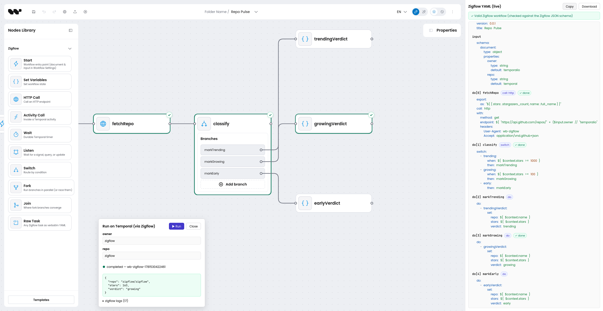

# wb-zigflow

Design [Zigflow](https://github.com/zigflow/zigflow) workflows visually - a standalone React
editor that turns Zigflow's [Serverless Workflow](https://serverlessworkflow.io) YAML into a
diagram and back, and runs it for real on [Temporal](https://temporal.io). Built on the
[Workflow Builder](https://www.workflowbuilder.io/) React SDK.



<sub>The **GitHub Repo Pulse** template: the visual editor (left), a Temporal run completing in the
Run panel (bottom), and the docked live YAML - validated against Zigflow's schema, with `done`
markers on the tasks that ran.</sub>

## Quick start

```sh
pnpm install
pnpm dev        # http://localhost:4202
```

The editor needs no backend. Pick a template from the palette, or hit **Import** and paste any
Zigflow workflow YAML. Running a workflow for real needs a little setup - see
[Execute on Temporal](#execute-on-temporal). Run the tests with `pnpm test`.

## What it does

- **Import** any Zigflow workflow onto the canvas, with auto-layout. Import is _total_: constructs
  without a typed node yet fall back to editable Raw Task nodes, so a valid file never fails to load.
- **Edit** visually - nodes, branches, conditions, and per-task data flow (`if:`, `export.as`,
  `output.as`). Workflow-level `document:` and `input:` live in a **Workflow Settings** dialog,
  not on a node.
- **Live YAML** - a panel docked beside the editor re-serializes the diagram as you type. It is
  syntax-highlighted, continuously validated (graph checks + Zigflow's JSON schema), and pins every
  problem to the task that caused it: a disconnected switch branch, a node that wouldn't make it
  into the YAML, invalid YAML in a field, or a schema violation.
- **Linked views** - hovering or selecting a node highlights its YAML section, and the reverse.
- **Undo / redo** - toolbar buttons and `Ctrl+Z` / `Ctrl+Y`; node drags coalesce into one entry.
- **Export** - copy or download the full YAML at any point.

## Execute on Temporal

The **Run** button executes the diagram for real - through the actual Zigflow runtime on a local
Temporal. Enter the workflow input (a form generated from the workflow's `input:` schema, or raw
JSON) and watch it run. Requirements:

```sh
# 1. zigflow binary. This installer auto-detects your OS + CPU arch.
#    Other methods (Homebrew cask, Docker, manual): https://zigflow.dev/docs/getting-started/installation
curl -fsSL https://get.zigflow.dev | sh

# 2. a local Temporal dev server. Run ONE of these. Both bind 7233/8233, so don't run both.

#    a) Temporal CLI. Install it first (macOS: brew install temporal,
#       other platforms: https://docs.temporal.io/cli#install), then:
temporal server start-dev

#    b) or Docker, with no CLI install needed:
docker run --rm -d -p 7233:7233 -p 8233:8233 temporalio/temporal server start-dev --ip 0.0.0.0
```

How it works: a dev-only Vite middleware (`vite-plugin-zigflow-exec.ts`) writes the canvas YAML to
a temp file, spawns `zigflow run` (a Temporal worker that emits CloudEvents), starts the workflow
via `@temporalio/client` with your input, and awaits the result. Zigflow's CloudEvents
(`dev.zigflow.task.started/completed/faulted`, `subject` = task name) stream to the browser over
SSE and drive **live highlighting**: the running task flashes in the YAML panel and its canvas node
gets a border, completed tasks a ✓, faults a ✕. `TEMPORAL_ADDRESS` and `ZIGFLOW_BIN` override the
defaults (`localhost:7233`, `zigflow` on PATH).

## What's modeled

| Node          | Zigflow task                                              |
| ------------- | --------------------------------------------------------- |
| Start         | `document:` + `input:` - edited in Workflow Settings       |
| Set Variables | `set`                                                     |
| HTTP Call     | `call: http` (method, endpoint, headers, body)            |
| Activity Call | `call: activity` (name, arguments, task queue)            |
| Wait          | `wait` (seconds/minutes/hours/days or `until`)            |
| Listen        | `listen` - Temporal signal / query / update               |
| Switch        | `switch` with conditional cases routing to named flows    |
| Fork          | `fork` - parallel branches, optional `compete` racing     |
| Join          | where fork branches converge (serializes to nothing)      |
| Raw Task      | **any** task as verbatim YAML - the import escape hatch   |

Round-trips are lossless (except YAML comments, and anchors, which resolve on parse): unmodeled
constructs (`for`, `try`, `run`, …) ride through as Raw Task nodes, and `export → import → export`
is a fixed point.

## Templates

- **GitHub Repo Pulse** does something real: it fetches a repository's live star count over
  `call: http`, captures it with `export.as`, and routes on the number with a `switch`
  (trending / growing / early). Input-driven (`owner` / `repo`), so it runs out of the box.
- **Authorise Change Request** is not hand-built - it is the importer's live output for
  [`zigflow/examples/authorise-change-request`](https://github.com/zigflow/zigflow/tree/main/examples/authorise-change-request)
  (vendored under `src/data/fixtures/`): a human-in-the-loop approval where a durable timer races a
  reviewer signal via `fork: compete`.
- **Order Routing** mirrors
  [`zigflow/examples/switch`](https://github.com/zigflow/zigflow/tree/main/examples/switch).

The test suite asserts that importing the upstream approval example produces typed nodes only (zero
escape hatches), that the re-export deep-equals the original parse, that it validates against
Zigflow's published JSON schema (vendored), and that `export → import → export` is a fixed point.

## Graph model conventions

- The main chain runs Start → task → task…; only Switch and Fork branch.
- Switch is terminal: each case routes to a named sub-flow (`then:`). Fork is not - branches
  converge on an explicit **Join** node and the main chain continues after it.
- An unconditional Switch branch is the catch-all `default` case; an imported switch keeps each
  case's original name, and two unnamed catch-alls de-duplicate to `default` / `default2`.
- Task names derive from node labels: lowerCamelCase names round-trip verbatim, other forms are
  normalised to lowerCamelCase. Duplicate task names are allowed (the DSL permits them).

## Known limitations

- `for`, `try/catch`, `run`, `raise`, `emit`, flow directives (`continue`/`exit`/`end`),
  `listen.to.all`, and task-level `metadata`/`timeout` aren't typed nodes yet - they import as Raw
  Task nodes (still editable, still export correctly).
- Switch `when` expressions import structurally only for single comparisons (`${ $x == "y" }`);
  anything richer keeps the whole switch as a Raw Task.
- Auto-layout is simple layered placement; no overlap avoidance for deeply nested branches.

## License

Apache-2.0. The vendored example workflow and JSON schema under `src/data/fixtures/` are from the
[Zigflow](https://github.com/zigflow/zigflow) project (Apache-2.0, Zigflow authors).
